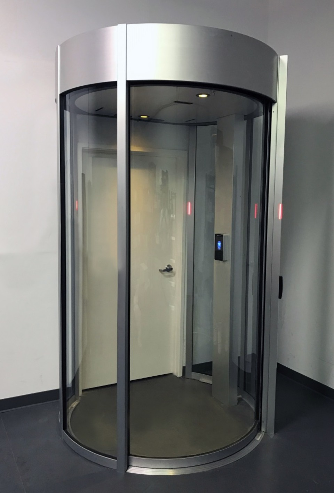

# Electronic entrance gate

## Introduction

As a school project we have had the opportunity to hack a gate. We received this gate from a data center because it was no longer used. It came in many pieces that together should form a gate. By experiencing this entire process of building up, we could come up with many attack scenarios. All the attacks are listed below. 

Our goal is to execute the attack scenarios on the gate. But the wiring and the PLC are hard to get started. That is why we have only succeeded to building the gate physically.

## Attacking scenario's

* Power off the gate.
* Take out the side door, it only rests on 3 pins.
* If the reference number is stored on NFC, read and change reference number \(brute force\)
* Face recognition bypass with photo and or 3D simulation/animation
* Physically break open the gate
* Utilize a lockpick set.
* Intercept verification-request\(s\)
* Exploit Software vulnerabilities
* Social engineering: get the key to take off the roof panel\(PLC and electronics becomes exposed\)
* Unscrew the keyhole, this will open up the wiring

