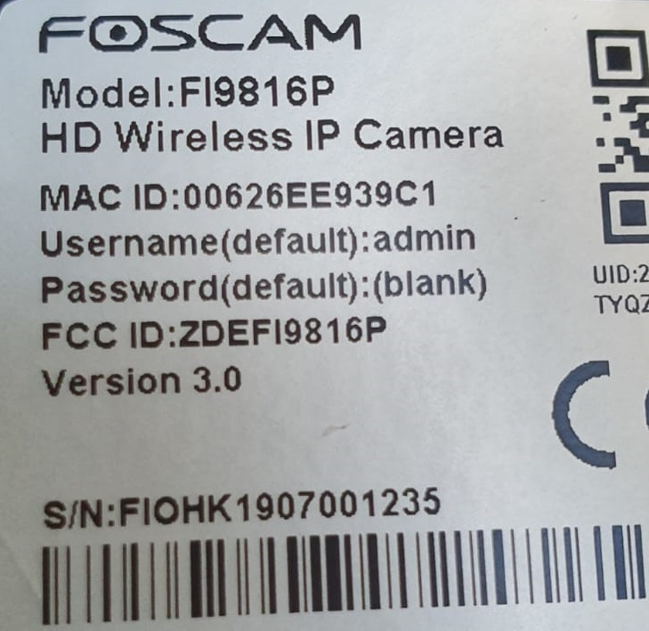
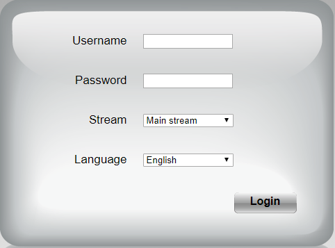
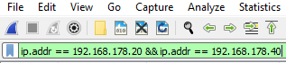
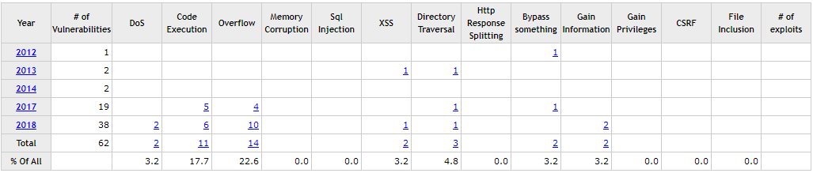

# Foscam IP-camera

## Device specifications

| Type | Specification |
| :--- | :--- |
| Device name | Foscam FI9816P IP-camera |
| UID | 2RRH79GIM6GU4TYQZZZZEY2Z |
| MAC ID | 00626EE939C1 |
| System firmware version | 1.12.5.4 |
| Application firmware version | 2.81.2.35 |
| Plug-in version | 5.1.0.12 |


## Findings

During the installation process it becomes clear that these devices still come with a default username and password \(see image below\).

  


After the installation is complete, either by setting the camera up over wifi or via cable, we can run a scan to see which ports are being used. The nmap commands used are -O \(OS detection\) and -sV \(version of service\).

```text
Nmap scan report for 192.168.178.40
Host is up (0.0068s latency).
Not shown: 995 closed ports
PORT STATE SERVICE VERSION
88/tcp open http lighttpd 1.4.49
443/tcp open ssl/http lighttpd 1.4.49
554/tcp open rtsp?
888/tcp open accessbuilder?
8080/tcp open http-proxy HiIpcam/V100R003 VodServer/1.0.0

PORT STATE SERVICE
88/tcp open kerberos-sec
443/tcp open https
554/tcp open rtsp
888/tcp open accessbuilder
8080/tcp open http-proxy
MAC Address: 00:62:6E:E9:39:C1 (Unknown)
Device type: general purpose
Running: Linux 2.6.X|3.X
OS CPE: cpe:/o:linux:linux_kernel:2.6 cpe:/o:linux:linux_kernel:3
OS details: Linux 2.6.32 - 3.10
```


When navigating to the device on port 88 we are greeted by the IPCam login form.




Ofcourse, there is no HTTPS available. Lets utilize wireshark and see if we can capture some interesting data. By setting a display filter we can solely focus on the network traffic between us and the IPCam client.




Now, when we submit a login request, we will be able to see the entire http request. By using the 'find packet' option, we can look for certain keywords in the packet bytes.


The keyword 'username' gets found in a packet with the Push flag \(PSH, ACK\). When following the TCP stream we can see our request quite clearly.

```text
GET / HTTP/1.1
Host: 192.168.178.40:88
Connection: keep-alive
Cache-Control: max-age=0
Upgrade-Insecure-Requests: 1
User-Agent: Mozilla/5.0 (Windows NT 10.0; Win64; x64) AppleWebKit/537.36 (KHTML, like Gecko) Chrome/79.0.3945.117 Safari/537.36
Accept: text/html,application/xhtml+xml,application/xml;q=0.9,image/webp,image/apng,*/*;q=0.8,application/signed-exchange;v=b3;q=0.9
Referer: http://192.168.178.40:88/
Accept-Encoding: gzip, deflate
Accept-Language: nl-NL,nl;q=0.9,en-US;q=0.8,en;q=0.7
Cookie: language=ENU; userName=testusername; remenber=; pwd=
If-None-Match: "323347221"
If-Modified-Since: Mon, 17 Sep 2018 01:32:05 GMT
```

Despite the fact that the client uses HTTP, we're still not able to catch the complete login credentials. It seems like there is javascript present which scrambles the user input before completing the request. This does make it harder to retrieve a victims login credentials but not impossible. A possible method could be a Man in the middle attack with an exact copy of the client's login form but with the javascript function\(s\) taken out. Another method could be injecting custom javascript using [mitm](https://github.com/mitmproxy/mitmproxy/tree/master/examples) proxy.


On further packet inspection we find a GET request to the cgi-bin.

```text
GET /cgi-bin/CGIProxy.fcgi?cmd=getSWFlag HTTP/1.1
Host: 192.168.178.40:88
Accept:*/*
Connection: Close

.HTTP/1.1 200 OK
Content-Type: text/plain
X-Frame-Options: SAMEORIGIN
Content-Length: 72
Connection: close
Date: Tue, 14 Jan 2020 18:50:20 GMT
Server: lighttpd/1.4.49

<CGI_Result>
    <result>0</result>
    <flag>0011</flag>
</CGI_Result>
```

 As seen below, Result 0 means that the request was successful.

| Value | Meaning |
| :--- | :--- |
| 0 | Success |
| -1 | CGI request string format error |
| -2 | Username or password error |
| -3 | Access denied |
| -4 | CGI execute fail |
| -5 | Timeout |
| -6 | Reserve |
| -7 | Unkown error |
| -8 | Reserve |


When attempting to reach the directory /cgi-bin/ we are prompted with a 403 forbidden.

```text
curl http://192.168.178.40:88/cgi-bin
2020-01-13 13:06:42 Error 403: Forbidden.
```

But, when we try to reach the CGIProxy we get a XML formatted response.

```text
curl http://192.168.178.40:88/cgi-bin/CGIProxy.fcgi?cmd=

<CGI_Result>

    <result>-3</result>

</CGI_Result>
```

After attempting a lot of different parameters, we can conclude that issueing commands via the CGIProxy without credentials will most likely not result into leakage of data or execution of these parameters. All issued commands resulted in either a -2 \(username or password error\) or a -3 \(access denied\). 


## CVE

Over the years, researchers have found numerous vulnerabilities in foscam cameras. 



For this research, a few have been tested. Luckily for the consumer, it seems like all of these flaws have been patched. After the rise of IOT threats, it looks like foscam decided to put more time into the security aspect of their development cycle. As you can see in the picture, there haven't been any new vulnerabilities since 2018. This doesn't mean that there aren't any but it shows that foscam actually cares about the security of their products by rolling out frequent updates and security patches. 

**Tested vulnerabilities** 

* CVE-2018-6830 - Arbitrary File Deletion Vulnerability
* CVE-2018-6832 - Stack-based Buffer Overflow Vulnerability
* CVE-2018-6831 - Shell Command Injection Vulnerability
* CVE-2018-19067 - There is a hardcoded Ak47@99 password for the factory~ account.
* CGIProxy request DOS - Custom attack


## Other possible attacks

* Hard reset - there is a reset button on the bottom of the device. After reboot, settings will be cleared and a possible attacker could sign in with default credentials. 
* MITM phishing attack - an attacker could fool the router and owner of the camera into thinking that his malicious device is the IP-camera which hosts the web client. By taking out the javascript files an attacker would be able to read the content of the authentication packet in clear text.
* Injecting javascript using MITM proxy - an attacker could inject malicious javascript which could capture authentication credentials and/or other data.
* Backdoor via firmware downgrade - an attacker could potentially create a backdoor on the device by first gaining access, followed by downgrading the firmware to a vulnerable version which could result into exploitation. 


